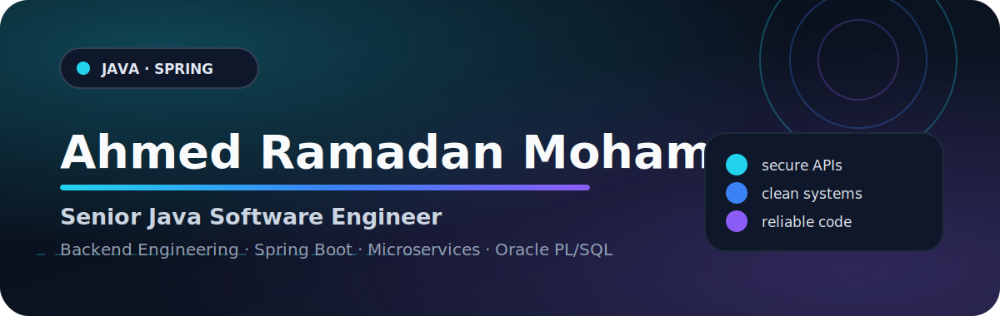

<!--
  Premium GitHub Profile README
  Keep this file at the root of the repository named exactly like your GitHub username.
  Required existing local file: assets/profile.gif
  Included local design assets: assets/*.svg
-->

 

 

 

  

<a href="#about-me">About</a> ·
<a href="#core-stack">Stack</a> ·
<a href="#experience">Experience</a> ·
<a href="#projects">Projects</a> ·
<a href="#education">Education</a> ·
<a href="#github-activity">GitHub</a>

  

 

I am a **Senior Java Software Engineer at Vodafone Egypt**, contributing to backend services for financial systems within the **Vodafone Cash Team**.

I design, develop, secure, integrate, and troubleshoot enterprise backend systems. My engineering priorities are **clear architecture, production reliability, secure APIs, maintainable code, and predictable system behavior**.

> **Primary focus:** Java backend engineering, Spring Boot services, API security, enterprise integrations, Oracle database workflows, and production troubleshooting.

 

- Build secure backend services and enterprise integrations.
- Develop REST APIs using Java, Spring Boot, and Spring Security.
- Work with Oracle Database, SQL, PL/SQL, and performance-sensitive data workflows.
- Apply OOP, SOLID, Clean Code, design patterns, testing, and structured problem solving.
- Expand continuously into distributed systems, cloud-native engineering, DevOps, and system design.

 

### Backend Engineering

 

<strong>Java SE 17 · Java EE · Spring Boot · Spring MVC · Spring Data JPA · Spring Security · Spring Cloud · Hibernate · Maven · REST APIs · Microservices</strong>

 

### Databases & Data Engineering

&nbsp;&nbsp;

  

<strong>Oracle SQL · PL/SQL · RMAN · SQL Server · T-SQL · PostgreSQL · MySQL · Database Design · Query Optimization · Troubleshooting</strong>

 

### DevOps, Cloud & Engineering Tools

 

<strong>Git · GitHub · GitLab · SVN · Docker · Jenkins · CI/CD · Linux · Red Hat · AWS · Azure · Postman · Swagger · Jira · Confluence</strong>

 

### Testing, Security & Engineering Practices

  

<strong>Authentication · Authorization · Secure APIs · Encryption · Unit Testing · Integration Testing · OOP · SOLID · Clean Code · Design Patterns · Data Structures · Algorithms</strong>

 

<strong>Additional Development Stack</strong>

 

  

 

### Vodafone Egypt — Senior Java Software Engineer

> Develop and support secure backend services for enterprise financial platforms.

- Develop backend services using **Java, Spring Boot, Spring Security, REST APIs, and Oracle Database**.
- Integrate services with internal enterprise systems to support reliable business operations.
- Implement authentication, authorization, validation, and API security using **Spring Security and JWT**.
- Investigate production, integration, backend, and database issues to improve stability.

---

### M.T.S IT — Java Software Engineer

- Developed Work Order and Network Inventory systems using **Java, Spring Boot, REST APIs, Oracle PL/SQL, and SQL**.
- Built modules for workflow automation, inventory tracking, reporting, and enterprise operations.
- Optimized PL/SQL procedures, packages, and triggers.
- Integrated services with **Oracle ADF, H.I.V.E, Telegraph, and internal systems**.

---

### M.T.S IT — Oracle Database Administration

- Administered Oracle 19c databases, including installation, configuration, patching, and maintenance.
- Managed schemas, users, privileges, tablespaces, indexes, database objects, and access control.
- Optimized SQL performance and handled backup and recovery using **Oracle RMAN**.

---

### Integrated Solution — C# Developer

- Developed an electronic invoice system using **C#, ASP.NET Core, SQL Server, and Oracle Database**.
- Built modules for invoicing, reporting, data management, and workflow automation.
- Supported migration from Windows Forms to ASP.NET Core and SQL Server-to-Oracle conversion.

 

<strong>🛒 E-commerce Platform</strong>

 

- Built a full-stack e-commerce platform using Spring Boot, PostgreSQL, and Angular.
- Structured the backend around maintainable APIs, persistence, validation, and security-focused practices.

<strong>👥 Human Resources Management System</strong>

 

- Developed an HR management application with secured backend workflows.
- Integrated PostgreSQL for structured, reliable, and scalable data storage.

<strong>💊 Stock Medicines System</strong>

 

- Developed a medicine stock management system with secure access controls.
- Designed a MySQL data model for organized and dependable inventory management.

 

### Education

- **Master of Science in Computer Science and Software Engineering** — AASTMT, In Progress
- **Bachelor of Science in Computer Science** — AASTMT, 2019

### Certifications & Professional Learning

<strong>View credentials</strong>

 

- Oracle Certified Associate, Java SE 8 Programmer
- Java SE 17 Professional Oracle Certification
- Oracle SQL and PL/SQL Developer Fundamentals
- Oracle Forms and Reports Developer
- Java Collections — LinkedIn Learning
- Java Programming — HackerRank
- Software Development Life Cycle — Udemy

 

<picture>
  <source media="(prefers-color-scheme: dark)" srcset="https://github-readme-stats.vercel.app/api?username=AhmedRmadanMohamed&show_icons=true&hide_border=true&rank_icon=github&bg_color=0B1220&title_color=22D3EE&text_color=CBD5E1&icon_color=8B5CF6" />
  <source media="(prefers-color-scheme: light)" srcset="https://github-readme-stats.vercel.app/api?username=AhmedRmadanMohamed&show_icons=true&hide_border=true&rank_icon=github&bg_color=F8FAFC&title_color=2563EB&text_color=334155&icon_color=7C3AED" />
  
</picture>

 

<picture>
  <source media="(prefers-color-scheme: dark)" srcset="https://streak-stats.demolab.com?user=AhmedRmadanMohamed&hide_border=true&background=0B1220&ring=22D3EE&fire=8B5CF6&currStreakLabel=22D3EE&sideLabels=CBD5E1&dates=94A3B8&currStreakNum=F8FAFC&sideNums=F8FAFC" />
  <source media="(prefers-color-scheme: light)" srcset="https://streak-stats.demolab.com?user=AhmedRmadanMohamed&hide_border=true&background=F8FAFC&ring=2563EB&fire=7C3AED&currStreakLabel=2563EB&sideLabels=334155&dates=64748B&currStreakNum=0F172A&sideNums=0F172A" />
  
</picture>

 

 

 

### Open to backend engineering discussions and Java ecosystem collaboration

