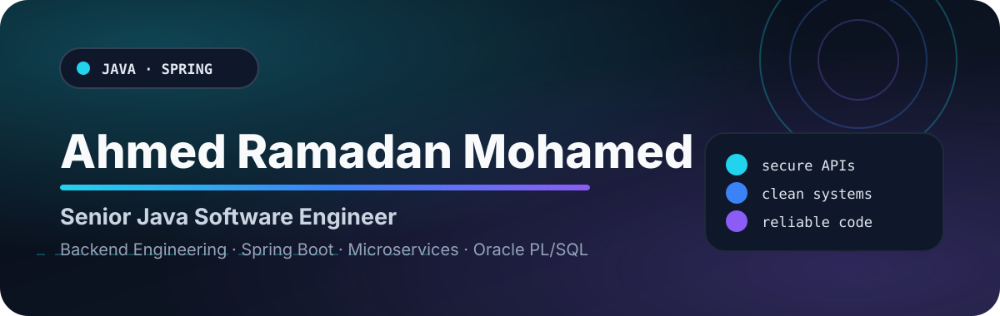

<!--
  Premium GitHub Profile README
  Keep this file at the root of the repository named exactly like your GitHub username.
  Required existing local file: assets/profile.gif
  Included local design assets: assets/*.svg
-->

 

 

 

  

<a href="#about-me">About</a> · <a href="#core-stack">Stack</a> · <a href="#experience">Experience</a> · <a href="#projects">Projects</a> · <a href="#education">Education</a> · <a href="#github-activity">GitHub</a>

  

 

Senior Java Backend Engineer and Oracle Certified Professional (Java SE 17 Developer) based in Cairo, Egypt, with 8+ years in software engineering and approximately 6 years focused on Java backend development. I design and build secure, production-grade services for financial and enterprise platforms.

At Vodafone Egypt, I contribute to Vodafone Cash, a platform serving approximately 25 million users. My work covers API and backend system design through production delivery for digital donations, QR-code payments, and Vodafone Shop–Vodafone Cash integration, alongside integrations with Siebel CRM, Oracle Database, and internal enterprise systems.

Core expertise:

• Java 17, Spring Boot, Spring Framework, Spring Data JPA, and Hibernate

• Microservices, REST APIs, Apache Kafka, event-driven architecture, and distributed systems

• Spring Security, OAuth 2.0, JWT, role-based access control, and API security

• Oracle Database, PostgreSQL, MySQL, Redis, SQL/PLSQL tuning, and caching

• Docker, Kubernetes, CI/CD, Jenkins, Maven, Git, AWS, and Azure

• JUnit, Mockito, unit testing, integration testing, Testcontainers, and SonarQube

I develop business-critical backend flows, investigate production incidents, optimize database performance, review pull requests, and help teammates resolve technical problems. My focus is practical system design, reliable distributed services, clean code, and maintainable delivery.

I partner with DevOps teams on CI/CD releases to AWS and Azure environments.

Open to Senior Java Backend Engineer opportunities across Egypt, the Gulf, and Europe, including remote, full-time, and contract roles.

 

Design and develop secure Java 17 and Spring Boot backend services and microservices.

Build REST APIs for financial transactions, customer journeys, and enterprise applications.

Integrate backend services with Siebel CRM, Vodafone Shop, Oracle Database, and internal platforms using Apache Camel.

Implement authentication, authorization, JWT security, validation, and secure API controls.

Optimize SQL and PL/SQL components and troubleshoot production and integration incidents.

Apply OOP, SOLID, Clean Code, design patterns, JUnit, Mockito, and structured problem solving.

 

Backend Engineering

&nbsp;

&nbsp;

&nbsp;

&nbsp;

&nbsp;

&nbsp;

&nbsp;

 
&nbsp;

&nbsp;

&nbsp;

&nbsp;

&nbsp;

 

Databases & Data Engineering

&nbsp;

&nbsp;

&nbsp;

&nbsp;

&nbsp;

&nbsp;

&nbsp;

 
&nbsp;

&nbsp;

&nbsp;

 

DevOps, Cloud & Engineering Tools

&nbsp;

&nbsp;

&nbsp;

&nbsp;

&nbsp;

&nbsp;

&nbsp;

 
&nbsp;

&nbsp;

&nbsp;

&nbsp;

&nbsp;

&nbsp;

&nbsp;

&nbsp;

&nbsp;

 

Testing, Security & Engineering Practices

&nbsp;

&nbsp;

&nbsp;

&nbsp;

&nbsp;

&nbsp;

&nbsp;

&nbsp;

&nbsp;

&nbsp;

 
&nbsp;

&nbsp;

&nbsp;

&nbsp;

&nbsp;

&nbsp;

 

<strong>Additional Development Stack</strong>

 

&nbsp;

&nbsp;

&nbsp;

&nbsp;

&nbsp;

&nbsp;

&nbsp;

 
&nbsp;

&nbsp;

&nbsp;

&nbsp;

 

<h3><strong>Vodafone Egypt — Senior Java Software Engineer</strong></h3>

Contribute to Vodafone Cash, a financial platform serving approximately 25 million users, as part of the backend engineering team.

• Design and deliver Java 17 and Spring Boot microservices and REST APIs for digital donations, QR-code payments, and Vodafone Shop–Vodafone Cash integration, from system design to production release.

• Build event-driven flows with Apache Kafka and integrate Siebel CRM, Oracle Database, and enterprise platforms, using Apache Camel where appropriate.

• Implement transaction validation, JWT authentication, authorization, and role-based access control with Spring Security.

• Develop data-access components with Spring Data JPA and Hibernate; optimize Oracle SQL and PL/SQL for backend performance and reliability.

• Investigate production incidents and resolve root causes across distributed services, APIs, messaging, integrations, and databases.

• Write unit and integration tests with JUnit and Mockito, review pull requests, and support teammates with technical problem-solving.

• Collaborate with DevOps on CI/CD releases to AWS and Azure environments managed by the DevOps team.

<h3><strong>M.T.S IT — Java Software Engineer</strong></h3>

Promoted from Oracle Database Administrator to Java Software Engineer, bringing database expertise to backend development for financial and telecommunications applications.

• Developed Java and Spring Boot microservices for 2 enterprise platforms: Network Inventory, supporting financial transaction workflows, and Work-Order Management for telecommunications operations.

• Built REST APIs and Oracle ADF integrations for workflow automation, inventory tracking, and reporting.

• Delivered changes from technical analysis and system design through production release; troubleshot application, integration, and database issues.

• Implemented authentication, authorization, and request validation with Spring Security.

• Designed and optimized Oracle SQL and PL/SQL, including tables, stored procedures, packages, triggers, and complex queries.

• Wrote unit and integration tests with JUnit and Mockito and contributed to CI/CD and release workflows using Docker, Maven, and Git.

<h3><strong>M.T.S IT — Oracle Database Administrator</strong></h3>

Supported Oracle databases across development, testing, and production environments for enterprise applications.

• Administered Oracle Database 19c, including installation, configuration, patching, upgrades, health checks, and production support.

• Tuned SQL and PL/SQL using execution plans, indexing, statistics, and schema optimization.

• Implemented RMAN backup and recovery procedures and managed users, roles, privileges, tablespaces, and data files.

• Supported migrations and releases; investigated database, storage, connectivity, and application-integration incidents.

• Worked with application teams to resolve database issues and document repeatable administration and recovery procedures.

<h3><strong>Integrated Solutions — C# Developer</strong></h3>

Built and supported a client-facing electronic invoicing product using C# and ASP.NET Core.

• Partnered with another developer to modernize a legacy Windows Forms application into a web solution, covering implementation, migration, and production delivery.

• Developed REST APIs and backend modules for invoicing, reporting, data management, and workflow automation; implemented authentication, authorization, and Entity Framework Core data access.

• Led the migration from SQL Server to Oracle Database 18c, including schema conversion, data migration, PL/SQL development, and query optimization.

• Wrote unit tests and supported CI/CD, IIS hosting, production deployments, and troubleshooting.

• Worked with stakeholders to clarify requirements and validate migrated functionality.

 

<h3><strong>🛒 E-commerce Backend Foundation</strong></h3>

 

Built a Spring Boot e-commerce backend foundation with MySQL persistence for products, categories, carts, orders, reviews, users, brands, and storefront parameters.

Structured the service around layered controllers, services, DTO mapping, repositories, validation, exception handling, and maintainable REST APIs.

<a href="https://github.com/AhmedRmadanMohamed/E-commerce">View source code →</a>

<h3><strong>👥 Human Resources API</strong></h3>

 

Built a secure Spring Boot HR API with stateless JWT authentication, role-based access control, BCrypt password hashing, Flyway migrations, OpenAPI documentation, Docker support, and MySQL persistence.

<a href="https://github.com/AhmedRmadanMohamed/Human-Resources-v2.0.0">View source code →</a>

<h3><strong>💊 Pharmacy Inventory System</strong></h3>

 

Developed a Spring Boot pharmacy inventory system for drugs, stock levels, suppliers, invoices, and discarded items.

Designed a MySQL data model with secure access controls and dependable inventory workflows.

<a href="https://github.com/AhmedRmadanMohamed/Stock-Pharmacy-">View source code →</a>

 

Education

Master of Science in Computer Science and Software Engineering — AASTMT, In Progress

Bachelor of Science in Computer Science — AASTMT, 2019

Certifications & Professional Learning

<strong>View credentials</strong>

 

Oracle Certified Professional: Java SE 17 Developer

Oracle Certified Associate: Java SE 8 Programmer

Oracle SQL and PL/SQL Developer Fundamentals

Oracle Forms and Reports Developer

Java Collections — LinkedIn Learning

Java Programming — HackerRank

Software Development Life Cycle — Udemy

 

<picture>
  <source media="(prefers-color-scheme: dark)" srcset="https://github-readme-stats.vercel.app/api?username=AhmedRmadanMohamed&show_icons=true&hide_border=true&rank_icon=github&bg_color=0B1220&title_color=22D3EE&text_color=CBD5E1&icon_color=8B5CF6" />
  <source media="(prefers-color-scheme: light)" srcset="https://github-readme-stats.vercel.app/api?username=AhmedRmadanMohamed&show_icons=true&hide_border=true&rank_icon=github&bg_color=F8FAFC&title_color=2563EB&text_color=334155&icon_color=7C3AED" />
  
</picture>

 

<picture>
  <source media="(prefers-color-scheme: dark)" srcset="https://streak-stats.demolab.com?user=AhmedRmadanMohamed&hide_border=true&background=0B1220&ring=22D3EE&fire=8B5CF6&currStreakLabel=22D3EE&sideLabels=CBD5E1&dates=94A3B8&currStreakNum=F8FAFC&sideNums=F8FAFC" />
  <source media="(prefers-color-scheme: light)" srcset="https://streak-stats.demolab.com?user=AhmedRmadanMohamed&hide_border=true&background=F8FAFC&ring=2563EB&fire=7C3AED&currStreakLabel=2563EB&sideLabels=334155&dates=64748B&currStreakNum=0F172A&sideNums=0F172A" />
  
</picture>

 

 

 

Open to backend engineering discussions and Java ecosystem collaboration

